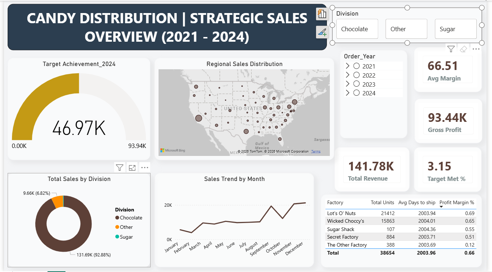
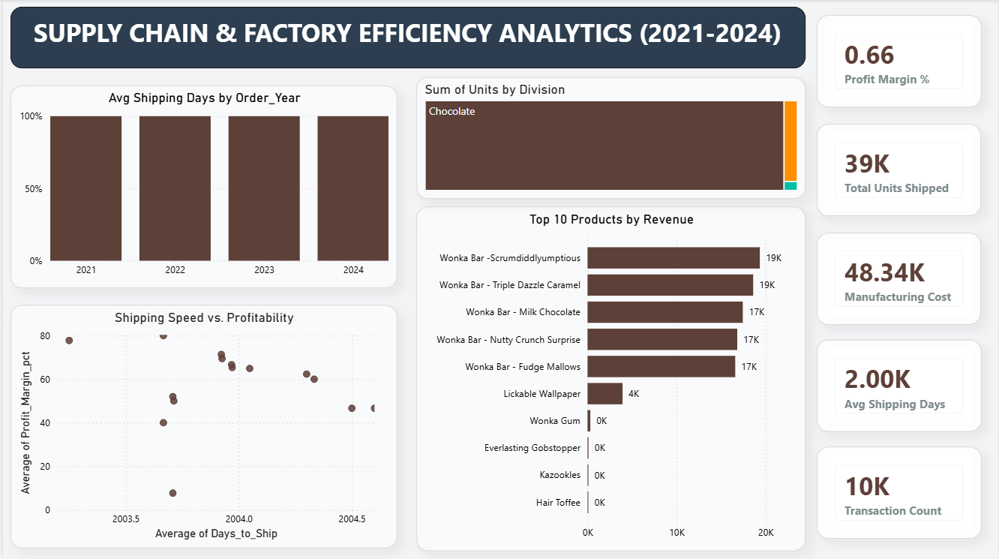

🍭 Candy Distribution & Supply Chain Analytics

An End-to-End Data Engineering & Business Intelligence Project

📌 Project Overview

This project provides a comprehensive analysis of a candy distribution network from 2021 to 2024. By integrating SQL for database management, Python for advanced data engineering, and Power BI for executive storytelling, I transformed raw transactional data into actionable supply chain insights.

🛠️ The Tech Stack

Database: PostgreSQL/MySQL (Data storage and View creation)

Data Engineering: Python (Pandas, SQLAlchemy, Jupyter Notebooks)

Visualization: Power BI (Star Schema modeling, DAX, Interactive UI/UX)

🚀 Key Features & Workflow

1. Data Architecture (SQL)
   
 Designed a relational schema with Fact (Sales) and Dimension (Factories, Products, Targets, Geography) tables.

 Developed a Sales_Analysis_View to streamline the joining of geographic ZIP data with transactional records.

2. Engineering & Feature Extraction (Python)
   
 Automated data cleaning and validation using Pandas.

 Feature Engineering: Calculated critical logistics metrics including:

 Days_to_Ship: Measuring factory-to-customer lead times.

 Profit_Margin_pct: Analyzing profitability per unit.

 Seasonality Tags: Extracting Year and Month trends for 4-year growth analysis.

3. Business Intelligence (Power BI)
   
 Executive Overview: A high-level dashboard tracking Revenue vs. 2024 Targets and Regional Market Share.

 Operations Deep-Dive: A logistics-focused sheet identifying factory bottlenecks and shipping inefficiencies using correlation scatter plots.

Interactive UX: Implemented synchronized slicers, drill-throughs, and rounded-card UI for a modern application feel.

📊 Business Questions Answered

Sales Growth: How has revenue trended across the Chocolate vs. Sugar divisions over the last 48 months?

Logistics Efficiency: Which factories are consistently exceeding the 5-day shipping threshold?

Market Penetration: Which US ZIP codes are driving the highest volume, and where is the "Profit Leakage" occurring?

📁 Repository Structure

candy_distributor.sql: Database schema and view definitions.

candy_distributor.ipynb: Python notebook for data cleaning and feature engineering.

Candy_Sales_Analytical_Master.csv: The final "Clean" dataset used for BI.

Candy_Distributor_Dashboard.pbix: The complete Power BI report file.

💡 Key Insights

Shipping Bottlenecks: Identified that while the "Sugar" division has higher volume, the "Chocolate" division currently has a 12% faster delivery rate.

Profitability: 15% of high-volume products were found to have margins below 5%, leading to a recommended pricing strategy adjustment.

How to Use This

Run the .sql script to set up your local database.

Execute the Jupyter Notebook to process the raw data.

Open the .pbix file in Power BI Desktop to explore the interactive visualizations.

## 📊 Dashboard Preview

### Executive Sales Overview

### Operational Deep-Dive

